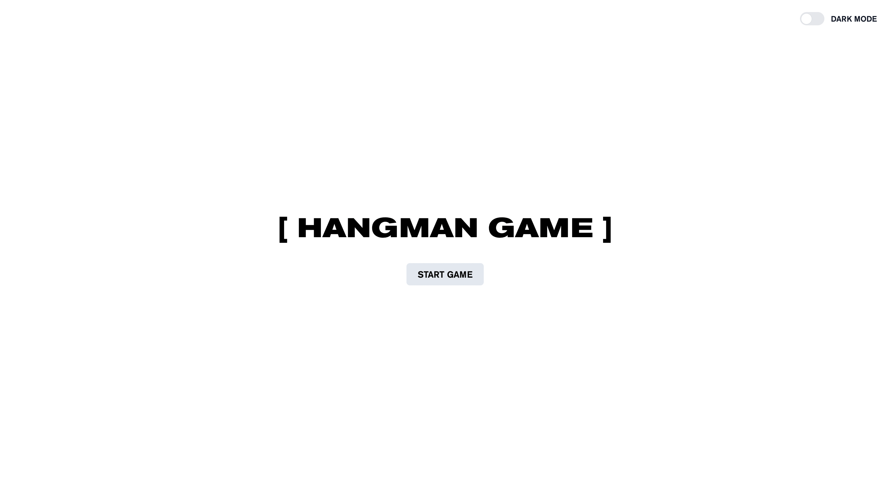
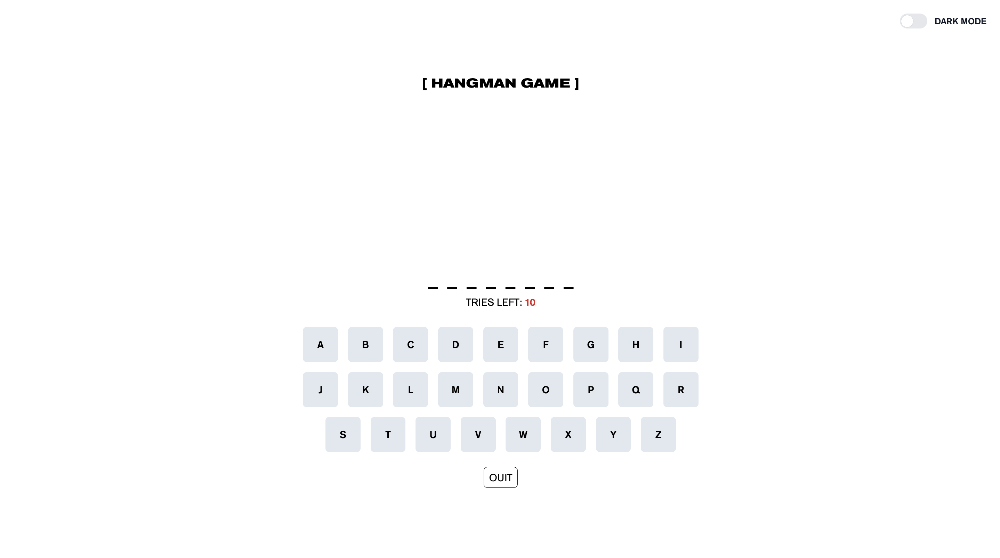
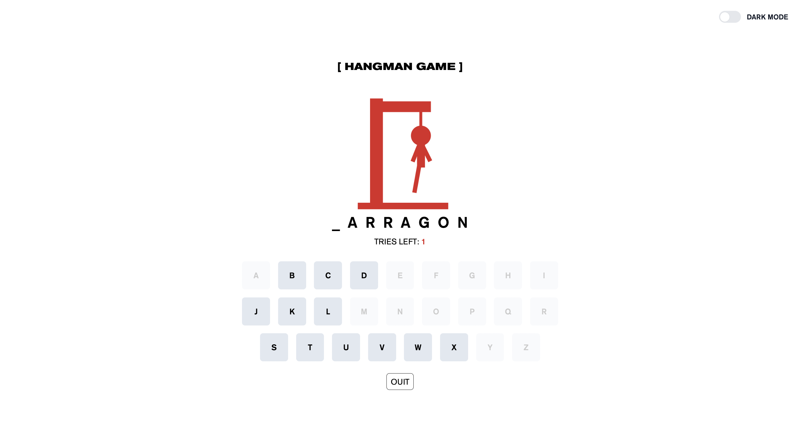
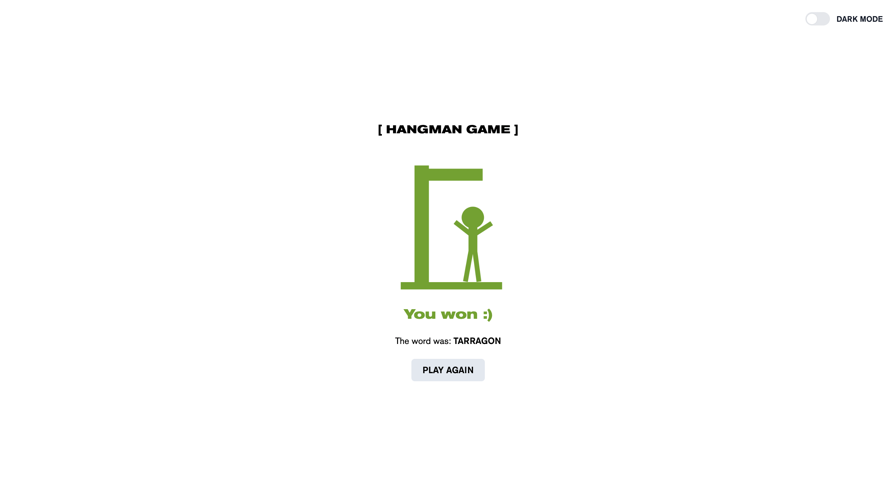
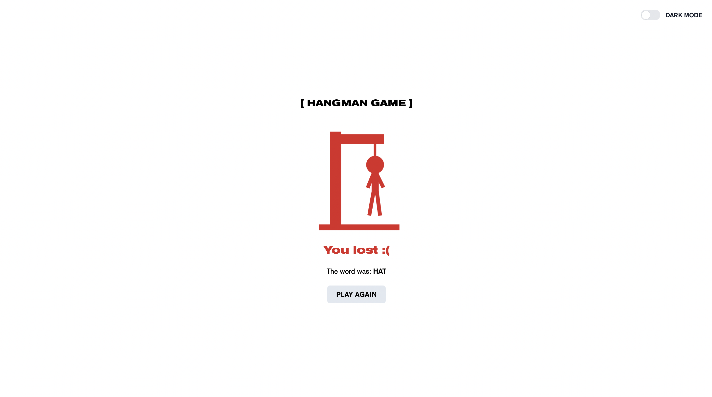

# Hangman-Man
Hangman-Man is an exciting word guessing game developed in vanilla JavaScript. Players are given a word that they must guess using the letters of the alphabet and the opportunity to make a limited number of mistakes.

<details><summary><b>Screenshots:</b></summary>





</details>

## Used stack
- Vanilla JS
- Tailwind CSS

## Install

1. Installing dependencies
```
npm install
```
2. Launch
```
npm run dev
```
### OR

https://nunespi.github.io/hangman-game/
